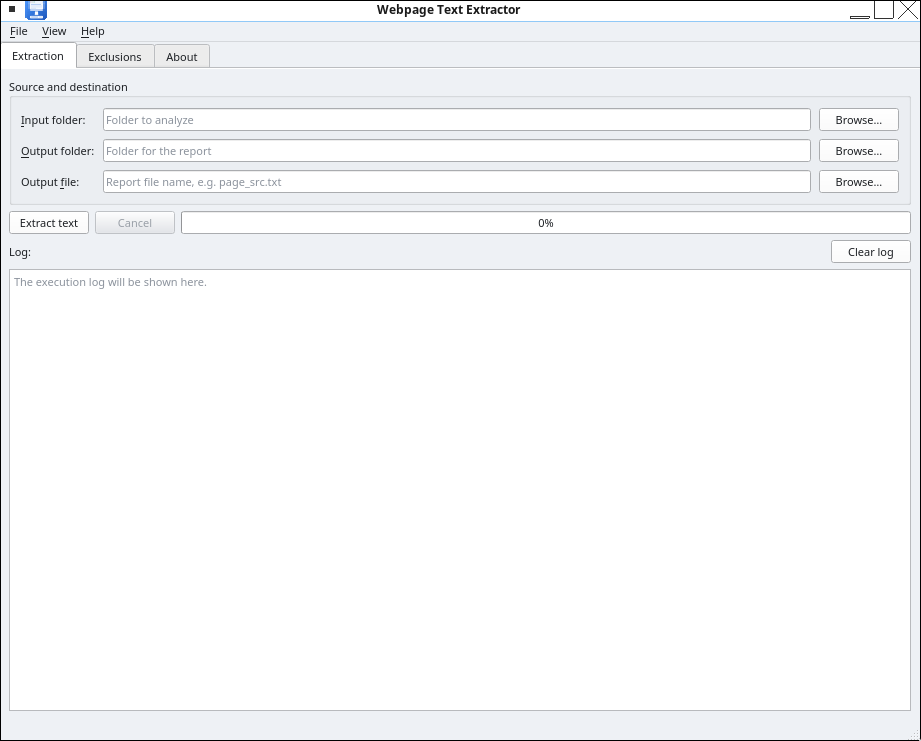
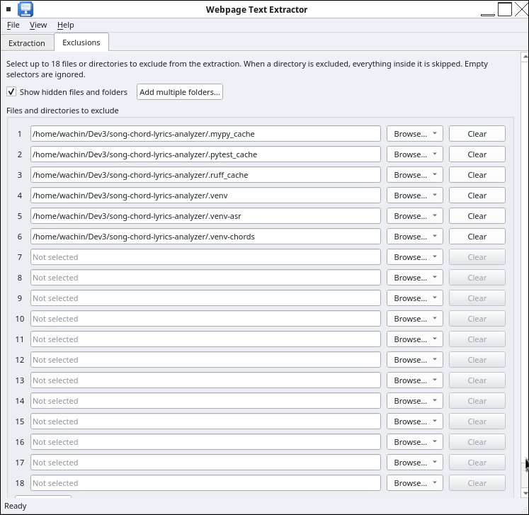

> **🇬🇧 Versión en inglés:** [README.md](README.md) — English version of this document.

# webpage-text-extractor

<p align="center">
  
</p>

**Extrae todo el texto de una carpeta — como una página web guardada con `Ctrl + S` en Chrome — y lo concatena en un único archivo `.txt` listo para enviar a un agente de IA.**

[](https://www.python.org/)
[](LICENSE)
[](#requisitos)

---

## ¿Por qué existe este script?

Cuando le pides a un agente de IA (ChatGPT, Claude, un asistente local, etc.) que analice una página web, muchas veces lo más práctico no es pasarle la URL sino **el contenido real de la página**: su HTML, sus estilos, su estructura.

El flujo es este:

1. Abres la página en Google Chrome.
2. Presionas `Ctrl + S` (en macOS `⌘ + S`) y eliges **"Página web completa"**.
3. Chrome crea una carpeta con el HTML de la página **y** todos sus recursos (CSS, JS, imágenes).
4. Ejecutas este script sobre esa carpeta.
5. Obtienes **un solo archivo `.txt`** con el contenido legible de todos los archivos de texto, claramente separado por encabezados.

Ese archivo `.txt` es mucho más fácil de manejar: lo adjuntas a tu agente de IA, lo pegas en un chat, o lo procesas como quieras, sin tener que enviar decenas de archivos sueltos.

## Características

- **Recursivo**: recorre todos los subdirectorios con `os.walk`.
- **Detección de texto**: intenta leer cada archivo como UTF-8; los binarios (imágenes, fuentes, videos) se listan por nombre sin ensuciar la salida.
- **Separadores claros**: cada archivo de texto va precedido de un encabezado con su ruta completa:
  ```
  --- Contenido del archivo de texto: Blog-ejemplo/pagina.html ---
  ```
- **Cero dependencias**: solo biblioteca estándar de Python. No necesitas `pip install` nada.
- **Tres versiones + una interfaz gráfica**:
  - `extract_text.py` — versión con argumentos de línea de comandos (recomendada).
  - `extract_text_simple.py` — versión original mínima, editas dos variables y listo.
  - `extract_text_gui.py` — interfaz gráfica con PyQt6 (ver [Interfaz gráfica](#interfaz-gráfica-pyqt6)).

## Requisitos

- Python **3.6 o superior** (funciona en Windows, macOS y Linux).
- Ninguna dependencia externa.

Comprueba tu versión con:

```bash
python3 --version
```

## Instalación

```bash
git clone https://github.com/wachin/webpage-text-extractor.git
cd webpage-text-extractor
```

No hay nada más que instalar.

## Interfaz gráfica (PyQt6)

El proyecto también incluye una interfaz gráfica multiplataforma (Windows, Linux y macOS): [`extract_text_gui.py`](extract_text_gui.py).

### Requisitos

- Python **3.8 o superior**.
- PyQt6:

  ```bash
  pip install PyQt6
  ```

- En **Linux**, instala las traducciones de Qt para que los diálogos estándar (*Abrir archivo / Guardar archivo*, etc.) aparezcan automáticamente en el idioma del sistema:

  ```bash
  sudo apt install qt6-translations-l10n
  ```

### Ejecutar la interfaz

```bash
python extract_text_gui.py
```

### Características

- **Pestaña Extracción**: selectores de carpeta de entrada, carpeta de salida y archivo de salida, con barra de progreso y registro de ejecución.
- **Pestaña Exclusiones**: 18 selectores para excluir directorios o archivos de la extracción (cada uno puede apuntar a un directorio o a un archivo). **Agregar varias carpetas…** permite seleccionar varias carpetas de una vez y rellena los selectores automáticamente, y marcar **Mostrar archivos y carpetas ocultos** revela elementos como `.git` que el sistema oculta por defecto (también se extraen, así que normalmente querrás excluirlos).
- **Ayuda → Acerca de**: diálogo de información para el desarrollador — icono del programa a la izquierda, texto a la derecha — con enlace de correo y enlace web clicables (abren el cliente de correo y el navegador predeterminados).
- **Temas claro y oscuro**: _Ver → Tema_.
- **Multiplataforma**: funciona en Windows, Linux y macOS; el estilo `Fusion` garantiza el mismo aspecto y temas funcionales en todos.
- **Internacionalización**: la interfaz está en inglés y todas las cadenas usan `tr()`, lista para traducir con [Qt Linguist](https://doc.qt.io/qt-6/linguist-index.html).

El icono del programa es [`icons/webpage-text-extractor.svg`](icons/webpage-text-extractor.svg), un SVG sencillo (sin filtros ni efectos raster) que puedes editar con [Inkscape](https://inkscape.org/).

### Captura de pantalla

**Pestaña Exclusiones** — 18 selectores, *Mostrar archivos y carpetas ocultos* para revelar elementos como `.git`, y *Agregar varias carpetas…* para rellenar varios selectores de una vez:



### Traducir la interfaz

```bash
pylupdate6 extract_text_gui.py -ts translations/webpage-text-extractor.ts   # extraer las cadenas
lrelease translations/webpage-text-extractor.ts                            # compilar el .qm
```

Coloca el archivo `webpage-text-extractor_<locale>.qm` resultante (por ejemplo `webpage-text-extractor_es.qm`) en la carpeta `translations/` y el programa lo cargará automáticamente al iniciar.

## Uso

### Versión con argumentos de línea de comandos (recomendada)

```bash
python extract_text.py <DIRECTORIO> [-o ARCHIVO_SALIDA] [-v]
```

| Argumento | Descripción | Por defecto |
|---|---|---|
| `directorio` | Carpeta que contiene los archivos a analizar | `Promts` |
| `-o`, `--output` | Nombre del archivo de salida | `<directorio>_src.txt` |
| `-v`, `--verbose` | Muestra en consola cada archivo procesado | desactivado |

### Versión simple

Edita las dos variables del final de `extract_text_simple.py`:

```python
directorio_a_analizar = "Promts"
archivo_de_salida = "Promts_src.txt"
```

Y ejecuta:

```bash
python extract_text_simple.py
```

## Ejemplos de uso

### Ejemplo 1 — Analizar una página web guardada con `Ctrl + S`

Guardaste `https://www.digitalocean.com/resources/articles/ai-blogs` con `Ctrl + S`. Chrome te creó esto:

```
Descargas/
└── 12 AI Blogs for Keeping Up With AI Trends in 2026 _ DigitalOcean.html
└── 12 AI Blogs for Keeping Up With AI Trends in 2026 _ DigitalOcean_files/
    ├── 6994b812b10824a2.css
    ├── main-app-9d77c18dd5f52d72.js
    ├── images(6)
    └── ...
```

Ejecuta:

```bash
python extract_text.py "Descargas/12 AI Blogs for Keeping Up With AI Trends in 2026 _ DigitalOcean" -o blog_ai.txt -v
```

Salida en consola:

```
  [texto]   Descargas/.../12 AI Blogs ....html
  [texto]   Descargas/..._files/6994b812b10824a2.css
  [omitido, no es texto] Descargas/..._files/images(6)
  ...
Análisis completado: 22 archivos de texto, 3 binarios/omitidos.
El informe se ha guardado en blog_ai.txt.
```

Y `blog_ai.txt` quedará con este formato:

```
--- Contenido del archivo de texto: Descargas/.../12 AI Blogs ....html ---
<!DOCTYPE html>
<html lang="en" ...>
...

--- Contenido del archivo de texto: Descargas/..._files/6994b812b10824a2.css
...

--- Archivo no de texto: Descargas/..._files/images(6) ---
```

Ahora adjuntas **un solo archivo** a tu agente de IA y le pides lo que necesites:

> "Este .txt contiene la página completa de un blog tecnológico (HTML + CSS). Hazme un prompt para construir una página con este mismo estilo."

### Ejemplo 2 — Usar el nombre de carpeta por defecto

Si tu carpeta se llama `Promts` (como en el script original), no necesitas argumentos:

```bash
python extract_text.py
```

Genera `Promts_src.txt`.

### Ejemplo 3 — Extraer el texto de una documentación local

Tienes una carpeta con documentación en Markdown, HTML o código fuente y quieres resumirla con IA:

```bash
python extract_text.py ./mi-proyecto/docs -o documentacion.txt
python extract_text.py ./mi-proyecto/src  -o codigo_fuente.txt -v
```

### Ejemplo 4 — Automatizar el flujo completo para varias páginas

```bash
#!/bin/bash
for carpeta in paginas_guardadas/*/; do
  nombre=$(basename "$carpeta")
  python extract_text.py "$carpeta" -o "salidas/${nombre}_src.txt"
done
```

## ¿Qué archivos reconoce como texto?

El script intenta leer **todo** como UTF-8. Además, omite directamente las extensiones típicamente binarias para no perder tiempo:

```
.png .jpg .jpeg .gif .webp .ico .svg .bmp
.mp4 .webm .mp3 .wav .ogg .m4a
.woff .woff2 .ttf .otf .eot
.zip .gz .br .rar .7z .pdf .exe .dll .so
```

Cualquier otro archivo que no se pueda decodificar como UTF-8 se marca como `--- Archivo no de texto: ... ---` en la salida, solo con su nombre.

## Consejos

- **Los archivos `.js` y `.css` también se extraen**: eso es intencional. Para replicar el diseño de una página (colores, tipografías, layout), el CSS es justo lo que tu agente de IA necesita.
- **Salidas grandes**: un sitio completo guardado con `Ctrl + S` puede generar varios MB de texto. Si tu agente tiene límite de contexto, procesa primero el `.html` principal o divide la salida.
- **Codificación**: todo se procesa como UTF-8. Si tienes archivos en otra codificación (p. ej. Latin-1), conviértelos antes o modifica `open(..., encoding="utf-8")`.
- **Orden de los archivos**: `os.walk` recorre en el orden del sistema de archivos. Si necesitas un orden específico, ordena la lista `archivos` dentro del script.

## Limitaciones

- No interpreta HTML: extrae el **código fuente tal cual**, no el texto visible renderizado. Esto es una ventaja para tareas de análisis y replicación de diseño, pero si quieres solo el texto visible, necesitarás algo como `BeautifulSoup` o `html2text`.
- Archivos muy grandes se cargan en memoria completa (normal para este caso de uso).

## Contribuir

Las contribuciones son bienvenidas:

1. Haz un fork del repositorio.
2. Crea una rama para tu mejora: `git checkout -b mi-mejora`.
3. Haz commit: `git commit -m "Descripción de la mejora"`.
4. Push a la rama: `git push origin mi-mejora`.
5. Abre un Pull Request.

Ideas de mejora: filtros por extensión, extracción solo del texto visible del HTML, soporte de codificaciones múltiples, modo de salida por archivo.

## Licencia

Este proyecto está bajo la Licencia GPL 3 — ver el archivo [LICENSE](LICENSE) para más detalles.

---

**Si te resulta útil, deja una estrella al repositorio. ¡Gracias!**